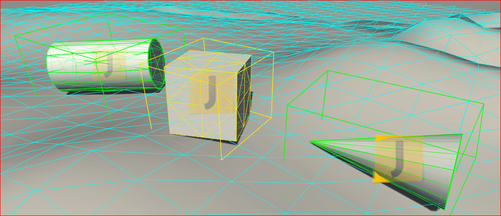
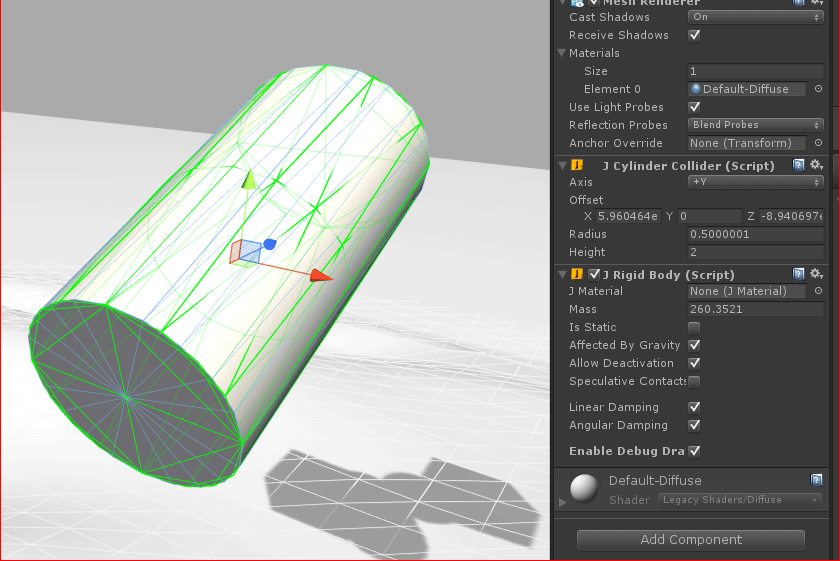

# What is it? #

This project is an abandoned attempt to integate [Jitter Physics][jitter] engine into [Unity][unity].

# License #

All the source code is published under [WTFPL version 2](http://www.wtfpl.net/about/).

[jitter]: http://jitter-physics.com/
[unity]: http://unity3d.com/
